# `dave.io`: Nuxt Edition 🌟

Welcome to the most spectacularly over-engineered personal website you'll encounter today.

This isn't just a website; it's a full-blown API fortress masquerading as a humble Nuxt application.

I decided my personal site needed JWT authentication, hierarchical permissions, schema validation, backup systems, and enough security features to make the **[Fortress of Solitude](https://dc.fandom.com/wiki/Fortress_of_Solitude)** feel inadequate.

## What Is This Beautiful Monstrosity?

This is a Nuxt 3 application that combines a personal website with a comprehensive API.

Most people would put these in separate repos. I am not most people.

1. **A Nuxt Website**: because everyone needs a place to dump their thoughts on the internet
2. **A Production API**: with JWT authentication, hierarchical permissions, and more enterprise features than most actual enterprises

Originally, my site was a simple **[Cloudflare Worker](https://developers.cloudflare.com/workers/)**. But why keep things simple when you can rebuild everything with type safety, comprehensive testing, CLI tools, backup systems, and enough abstractions to make you want to eat your own head?

## Features Which Nobody Asked For (But Everyone Secretly Wants)

### 🔐 Enterprise-Grade Authentication

JWT-based fortress protecting my digital empire with dual authentication methods:

- **Bearer Token Headers**: `Authorization: Bearer <jwt>` - For sophisticated API consumers
- **URL Parameters**: `?token=<jwt>` - For browsers and commitment-phobic clients
- **Hierarchical permissions** (`api:metrics`, `ai:alt`, etc.) with "Russian nesting dolls" approach
- **Token introspection** and validation endpoints
- **Token revocation** support with KV-based blacklist for immediate invalidation
- **CLI-based token management** with D1 database storage that would make enterprise admins weep with joy

#### 🔓 Public Endpoints (No JWT Required)

- `/api/internal/health`, `/api/internal/ping`, `/api/internal/worker` - Core system endpoints
- `/api/go/{slug}` and `/go/{slug}` - URL redirection service (gh, tw, li)

#### 🔒 Protected Endpoints (JWT Required)

- **`/api/internal/auth`** - Token validation (any valid JWT)
- **`/api/internal/metrics`** - API metrics (`api:metrics`, `api`, `admin`, or `*`)
- **`/api/ai/alt`** (GET/POST) - Alt-text generation (`ai:alt`, `ai`, `admin`, or `*`)
- **`/api/tokens/{uuid}/*`** - Token management (`api:tokens`, `api`, `admin`, or `*`)
#### 🔧 Token Generation

```bash
# Metrics dashboard access
bun jwt create --sub "api:metrics" --description "Metrics access" --expiry "30d"

# AI service access
bun jwt create --sub "ai:alt" --description "Alt-text generation" --expiry "7d"

# Full API access
bun jwt create --sub "api" --description "Full API access" --expiry "1d"

# Interactive mode
bun jwt create --interactive
```

**Permission Hierarchy**: `api:metrics` → `api` → `admin` → `*` (each level inherits access to lower levels)

### 🤖 AI Integration (Now With Real AI Magic!)

- Alt-text generation for images (URL or file upload) using Cloudflare AI
- Powered by `@cf/llava-hf/llava-1.5-7b-hf` model (because we don't mess around with fake AI)
- Because accessibility matters, even for personal sites that are way too complicated
- File size validation and proper error handling (up to 10MB images)
- Consistent authentication and response formatting across both GET and POST endpoints

### 📊 KV Metrics Which Would Make Google Jealous

- Comprehensive API metrics in JSON, YAML, or Prometheus formats
- Request/response statistics with Cloudflare metadata
- Perfect for when you want to obsess over your site's performance
- KV-cached metrics with automatic invalidation
- **KV Storage Architecture**: Fast metrics using hierarchical key-value storage
- **Hierarchical KV Keys**: Simple data with kebab-cased keys like `metrics:redirect:gh:clicks`
- **Real-time KV Metrics**: Every request, redirect, AI operation, and system event tracked

### 🔗 URL Shortening & Redirects

- `/go/gh` → GitHub profile (which saves you from typing)
- `/go/tw` → Twitter/X (when I remember social media exists)
- `/go/li` → LinkedIn (for professional pretenses)
- Click tracking with KV metrics integration


### 📱 Dashboard Data Feeds

- Hacker News RSS integration with hourly caching
- Because even personal sites need dashboards these days

### 💾 KV Storage Management (The Crown Jewel)

- Complete backup and restore system
- Pattern-based data filtering
- Production-ready with multiple safety confirmations
- CLI tool that handles your data with kid gloves

### 🛡️ Security Features Which Would Impress the NSA

- CORS headers that actually make sense
- Input sanitisation and validation with Zod
- Security headers that would make OWASP shed a single tear of joy
- Shell script responses for curl/wget requests

## Getting Started (For the Brave and Caffeinated)

### Prerequisites

- **Bun** (because npm is so last decade)
- **Node.js 18+** (if you insist on being traditional)
- **Cloudflare Account** (for the full experience)
- **A sense of humor** (for dealing with my code comments)
- **Coffee** (lots of it)

### Installation

```bash
# Clone this magnificent monstrosity
git clone https://github.com/daveio/next-dave-io.git
cd next-dave-io

# Install dependencies (bun is preferred, but we don't judge)
bun install

# Set up environment variables
cp .env.example .env
# Edit .env with your secrets (don't commit them, I have trust issues)

# Generate types and prepare Nuxt
bun run types
bun run nuxt prepare

# Start the development server
bun run dev
```

### Environment Variables

Create a `.env` file with these variables (we promise not to judge your naming conventions):

```bash
# JWT Secret (change this, seriously, I'm watching)
API_JWT_SECRET=your-super-secret-jwt-key-that-definitely-isnt-password123

# Cloudflare credentials (for when you want the full production experience)
CLOUDFLARE_API_TOKEN=your-cloudflare-api-token
CLOUDFLARE_ACCOUNT_ID=your-account-id

# Public API base URL
NUXT_PUBLIC_API_BASE_URL=/api
```

## API Documentation (The Crown Jewels)

### Authentication (Gateway to the Kingdom)

All protected endpoints require a JWT token. You can provide it via:

- **Authorization header**: `Authorization: Bearer <token>`
- **Query parameter**: `?token=<token>` (for when headers are too mainstream)

### Core Endpoints (The Essentials)

#### `GET /api/internal/health`

The only endpoint that doesn't judge you for not having authentication.

```bash
curl http://localhost:3000/api/internal/health
```

#### `GET /api/internal/ping`

Simple ping endpoint that logs KV metrics and shows off Cloudflare headers like a peacock.

```bash
curl http://localhost:3000/api/internal/ping
```

#### `GET /api/internal/worker`

Internal Worker runtime information (because transparency is trendy).

```bash
curl http://localhost:3000/api/internal/worker
```

#### `GET /api/internal/auth`

Token introspection and validation. Perfect for existential questions about your JWT's purpose in life.

```bash
curl -H "Authorization: Bearer <token>" http://localhost:3000/api/internal/auth
```

#### `GET /api/internal/metrics`

Get comprehensive API metrics in your preferred format (because choice matters).

```bash
# JSON (the sensible default)
curl -H "Authorization: Bearer <token>" http://localhost:3000/api/internal/metrics

# YAML (for the hipsters)
curl -H "Authorization: Bearer <token>" http://localhost:3000/api/internal/metrics?format=yaml

# Prometheus (for the monitoring-obsessed)
curl -H "Authorization: Bearer <token>" http://localhost:3000/api/internal/metrics?format=prometheus
```

#### `GET/POST /api/ai/alt`

Generate alt-text for images. Because accessibility is cooler than avocado toast.

```bash
# Via URL parameter (the lazy way)
curl -H "Authorization: Bearer <token>" "http://localhost:3000/api/ai/alt?url=https://example.com/image.jpg"

# Via POST body (the proper way)
curl -X POST -H "Authorization: Bearer <token>" \
  -H "Content-Type: application/json" \
  -d '{"url": "https://example.com/image.jpg"}' \
  http://localhost:3000/api/ai/alt

# File upload (for when you're feeling fancy)
curl -X POST -H "Authorization: Bearer <token>" \
  -F "file=@image.jpg" \
  http://localhost:3000/api/ai/alt
```


### Dashboard Endpoints (Because Data Is Beautiful)

#### `GET /api/dashboard/{name}`

Get dashboard data feeds. Currently supports `hackernews`.

```bash
# Hacker News feed (for your daily dose of tech drama)
curl -H "Authorization: Bearer <token>" http://localhost:3000/api/dashboard/hackernews
```

### Statistics & Redirects


#### `GET /go/{slug}`

URL redirects for the chronically lazy (we've all been there).

- `/go/gh` → My GitHub
- `/go/tw` → My Twitter/X
- `/go/li` → My LinkedIn

### Token Management (Handle With Care)

#### `GET /api/tokens/{uuid}`

Get token usage information.

#### `GET /api/tokens/{uuid}/metrics`

Detailed metrics for a specific token.

#### `GET /api/tokens/{uuid}/usage`

Token usage statistics.

#### `POST /api/tokens/{uuid}/revoke`

Revoke a token (relationship status: it's complicated).

## Scripts & Utilities (My Toolbox)

I have lovingly crafted some handy scripts in the `bin/` directory, now with shared modules to eliminate code duplication (because even I believe in DRY principles):

### `bin/jwt.ts` - JWT Token Management CLI (Now With Database Powers!)

```bash
# Initialize D1 database schema (one-time setup, like assembling IKEA furniture)
bun jwt init

# Create a new token (with great power...)
bun jwt create --sub "api:metrics" --description "Metrics access" --expiry "30d"

# Create an admin token (comes great responsibility)
bun jwt create --sub "admin" --description "God mode" --no-expiry --seriously-no-expiry

# Verify a token (trust, but verify)
bun jwt verify "eyJhbGciOiJIUzI1NiJ9..."

# List all your beautiful tokens (like a digital collection)
bun jwt list

# Show detailed info about a specific token (for the detail-oriented)
bun jwt show <uuid>

# Search for tokens (because sometimes you forget what you created)
bun jwt search --sub "api"                    # Find by subject
bun jwt search --description "test"           # Find by description
bun jwt search --uuid "123e4567-e89b"         # Find by UUID

# Revoke a token (relationship status: it's complicated)
bun jwt revoke <uuid>
bun jwt revoke <uuid> --confirm               # Skip the dramatic confirmation

# Interactive mode (for the GUI enthusiasts)
bun jwt create --interactive
```

**New Features Which Will Make Your Life Better:**

- **Automatic Configuration**: Reads D1 and KV IDs from `wrangler.jsonc` (because hardcoded IDs are so 2023)
- **Environment Override**: Environment variables still win over config files (hierarchy matters)
- **Graceful Degradation**: Works without Cloudflare credentials for basic operations (perfect for offline work)
- **D1 Storage**: Token metadata lives in your production database (persistent and searchable)
- **KV Revocation**: Immediate token blacklisting via KV storage (no waiting around)
- **Smart Error Handling**: Helpful error messages which actually help (revolutionary concept)

### `bin/api-test.ts` - HTTP API Testing Suite

```bash
# Test against local development server
bun run test:api

# Test against production (if you're feeling brave)
bun run test:api --url https://dave.io

# Test specific endpoints (because targeted testing is efficient)
bun run test:api --auth-only
bun run test:api --metrics-only
bun run test:api --ai-only
bun run test:api --dashboard-only

# Use an existing token (for when you're feeling prepared)
bun run test:api --token "eyJhbGciOiJIUzI1NiJ9..."
```

### `bin/kv.ts` - KV Storage Management (The Data Whisperer)

```bash
# Backup operations (because data loss is not an option)
bun run kv backup                    # Backup selected data patterns
bun run kv backup --all              # Backup everything (YOLO mode)

# Restore operations (for when things go sideways)
bun run kv restore kv-2025-05-29-213826.json

# Management operations (for the control freaks)
bun run kv list                      # List all KV keys
bun run kv list --pattern "metrics" # Filter by pattern
bun run kv wipe                      # Nuclear option (requires CONFIRM_WIPE=yes)
```

**Backup Patterns (simplified hierarchy):**

- `redirect:*` - URL redirect mappings (slug → target URL)
- `metrics:*` - All API metrics (resource-based hierarchy)
- `routeros:*` - RouterOS cache (legacy, may be removed)

### `bin/deploy-env.ts` - Secure Environment Deployment (The Security-Conscious Wizard)

```bash
# Deploy production environment variables from .env
bun run deploy:env
```

**What It Does (With Military Precision):**

- **Validates Configuration**: Ensures `CLOUDFLARE_API_TOKEN`, `CLOUDFLARE_ACCOUNT_ID`, and `API_JWT_SECRET` are set
- **Security First**: Refuses to deploy if dangerous API key/email combo is configured without proper tokens
- **Smart Filtering**: Excludes all `API_DEV_*` variables and legacy `CLOUDFLARE_API_KEY`/`CLOUDFLARE_EMAIL`
- **Production Safe**: Only deploys variables intended for production use
- **Secure Deployment**: Uses `wrangler secret put` with STDIN for maximum security (no secrets in command history)
- **Comprehensive Logging**: Shows what's being deployed, what's being skipped, and why

**Safety Features (Because Your Data Matters):**

- Won't deploy development variables (`API_DEV_*` prefix)
- Won't deploy insecure legacy authentication (`CLOUDFLARE_API_KEY`, `CLOUDFLARE_EMAIL`)
- Validates environment before attempting deployment
- Provides clear error messages when configuration is invalid
- Exits with proper status codes for CI/CD integration

## Testing (Because I Believe in Quality)

```bash
# Run unit tests (the foundation of trust)
bun run test

# Run tests with UI (fancy visual feedback)
bun run test:ui

# Run tests with coverage (for the perfectionists)
bun run test:coverage

# Test the API over HTTP (integration testing at its finest)
bun run test:api

# Type checking and linting (because standards matter)
bun run typecheck
bun run lint
bun run format

# The full monty (what I run before committing, and you should too)
bun check
```

## Deployment (To The Clouds!)

### Development

```bash
bun run dev
```

### Production Build

```bash
bun run build
```

### Cloudflare Workers Deployment (The Big Leagues)

#### Initial Setup (One-Time Pain)

```bash
# Create Cloudflare resources
wrangler kv:namespace create DATA
wrangler d1 create NEXT_API_AUTH_METADATA

# Update wrangler.jsonc with the resource IDs
# (Copy the IDs from the output above - the JWT tool will read them automatically)

# Initialize the D1 database schema (because empty databases are useless)
bun jwt init

# Deploy environment variables securely (reads from .env)
bun run deploy:env

# Deploy to the cloud
bun run deploy

# Test your production deployment
bun run test:api --url https://your-worker.your-subdomain.workers.dev

# Create your first production token (you'll need this)
bun jwt create --sub "admin" --description "Production admin access" --expiry "90d"
```

#### Ongoing Deployment (The Daily Grind)

```bash
# Make changes, test locally
bun run dev

# Run quality checks (don't skip this, I'm watching)
bun check

# Deploy to production
bun run deploy

# Verify everything works
curl https://your-production-url.com/api/health
```

## Project Structure (For the Architecturally Curious)

```plaintext
├── server/                  # The backend kingdom
│   ├── api/                 # API endpoints (the crown jewels)
│   │   ├── internal/        # Internal system endpoints
│   │   │   ├── auth.get.ts  # JWT validation
│   │   │   ├── health.get.ts # Health check
│   │   │   ├── ping.get.ts  # Simple ping
│   │   │   ├── metrics.get.ts # API metrics
│   │   │   ├── headers.get.ts # Request headers
│   │   │   └── worker.get.ts # Worker info
│   │   ├── ai/              # AI endpoints
│   │   │   ├── alt.get.ts   # Alt-text (GET)
│   │   │   └── alt.post.ts  # Alt-text (POST)
│   │   ├── dashboard/       # Dashboard data
│   │   │   └── [name].get.ts # Named dashboards
│   │   ├── go/              # URL redirects
│   │   │   └── [slug].get.ts # Redirect handler
│   │   └── tokens/          # Token management
│   │       └── [uuid]/      # Token operations
│   ├── utils/               # Server utilities (the workhorses)
│   │   ├── auth.ts          # Authentication logic
│   │   ├── response.ts      # Response helpers
│   │   ├── schemas.ts       # Zod validation schemas
│   │   └── environment.ts   # Runtime configuration
│   └── middleware/          # Server middleware (the gatekeepers)
│       ├── cors.ts          # CORS configuration
│       ├── error.ts         # Error handling
│       └── shell-scripts.ts # Shell script responses
├── test/                    # Unit tests (the safety net)
├── bin/                     # CLI scripts (my toolbox)
│   ├── jwt.ts              # JWT token management
│   ├── api-test.ts         # HTTP API testing
│   ├── kv.ts               # KV storage management
│   └── shared/             # Shared CLI utilities (DRY principles in action)
│       ├── cloudflare.ts   # Cloudflare client management
│       └── cli-utils.ts    # Common utilities and helpers
├── types/                   # TypeScript definitions
├── app.vue                  # Minimal frontend (placeholder for now)
└── public/                  # Static assets
```

## Technologies Used (The Foundation)

- **Nuxt 3**: Because Vue is delightful
- **TypeScript**: For when JavaScript isn't painful enough
- **Zod**: Schema validation which actually works
- **JOSE**: JWT handling done right
- **Vitest**: Testing which doesn't make you cry
- **Cloudflare Workers**: Because serverless is the future
- **Bun**: The runtime that makes everything faster
- **Biome**: Linting and formatting which just works
- **Commander**: CLI framework for the command-line warriors

## Contributing (If You Dare)

Found a bug? Want to add a feature? I welcome contributions, but be warned: I have strong opinions about code style and will judge your commit messages.

1. Fork the repository
2. Create a feature branch (`git checkout -b feature/amazing-feature`)
3. Make your changes (and write tests, I'm definitely watching)
4. Run the test suite (`bun run test && bun run test:api`)
5. Ensure everything passes (`bun check`)
6. Submit a pull request with a description that makes me smile
7. Prepare for code review feedback (I'm thorough)

## KV Metrics Schema (The Data Nerd's Paradise)

My implementation uses Cloudflare KV storage for fast, hierarchical metrics tracking that would make data scientists weep with joy.

### KV Storage Architecture

All metrics are stored in KV using a simplified hierarchical key structure for fast retrieval and easy aggregation:

```bash
# Redirect Storage and Metrics
redirect:gh                        # "https://github.com/daveio" - Target URL
redirect:tw                        # "https://twitter.com/daveio" - Target URL
metrics:redirect:gh                # "1234" - Click count for GitHub redirect
metrics:redirect:tw                # "567"  - Click count for Twitter redirect

# API Hit Tracking (by resource)
metrics:auth:hit:total             # "8901" - Total requests to /api/auth/*
metrics:auth:hit:ok                # "8700" - Successful auth requests
metrics:auth:hit:error             # "201"  - Failed auth requests
metrics:ai:hit:total               # "456"  - Total requests to /api/ai/*
metrics:ai:hit:ok                  # "450"  - Successful AI requests
metrics:ai:hit:error               # "6"    - Failed AI requests

# Authentication Events
metrics:auth:auth:succeeded        # "8700" - Successful authentications
metrics:auth:auth:failed           # "201"  - Failed authentications
metrics:ai:auth:succeeded          # "445"  - Successful AI auths
metrics:ai:auth:failed             # "11"   - Failed AI auths

# Visitor Classification
metrics:auth:visitor:human         # "7500" - Human visitors to auth endpoints
metrics:auth:visitor:bot           # "1200" - Bot visitors to auth endpoints
metrics:auth:visitor:unknown       # "201"  - Unknown visitor type
metrics:ai:visitor:human           # "400"  - Human visitors to AI endpoints
metrics:ai:visitor:bot             # "56"   - Bot visitors to AI endpoints
```

**IMPLEMENTED**: The simplified KV hierarchy is now active and replaces all legacy patterns.

```mermaid
---
config:
  theme: neo-dark
  layout: elk
  htmlLabels: true
id: ee3114f7-6c54-4dcc-a315-24c20d9a7d28
title: Cloudflare KV Store Key Hierarchy
---

flowchart TD
    %% ---
    %% KEY DEFINITIONS:
    %% TARGET_URL contains the target URL for the redirect.
    %% [resource] is the first part of the URL after /api, for example /api/foo/bar would be foo.
    %% /go is excluded from main metrics, as we handle redirect metrics separately.
    %% All integer types are hit counts of categories described by their key hierarchy.
    %% ---

    %% Root KV Store
    ROOT[["🗄️ Cloudflare KV Store<br/>_Core key-value storage_"]]

    %% Redirect Key Namespace
    subgraph REDIRECT_NS["📍 redirect: namespace<br/>_URL redirection keys_"]
        direction TB
        REDIRECT_KEY["`**redirect**
        _base key pattern_`"]
        REDIRECT_SLUG_KEY["`**redirect:[slug]**
        _specific redirect key_`"]
        REDIRECT_VALUE["`🎯 **Target URL**
        _string value_
        Contains destination URL for redirect`"]
    end

    %% Metrics Key Namespace
    subgraph METRICS_NS["📊 metrics: namespace<br/>_Metrics keys_"]
        direction TB

        METRICS_KEY["`**metrics**
        _base metrics key_`"]
        METRICS_RESOURCE_KEY["`**metrics:[resource]**
        _resource-specific metrics_
        [resource] = first URL segment after /api`"]

        %% Redirect Metrics Keys
        subgraph REDIRECT_METRICS_NS["📍 Redirect Metrics Keys<br/>/go endpoint"]
            direction TB
            REDIRECT_METRICS_KEY["`**metrics:redirect**
            _redirect tracking base_`"]
            REDIRECT_SLUG_METRICS_KEY["`**metrics:redirect:[slug]**
            _per-slug redirect tracking_`"]
            REDIRECT_COUNT_VALUE["`🔢 **Redirect Count**
            _integer value_
            Hit count for this redirect`"]
        end

        %% Hit Counter Keys
        subgraph HIT_COUNTER_NS["🎯 Hit Counter Keys<br/>_Request success/failure tracking_"]
            direction TB
            HIT_KEY["`**metrics:[resource]:hit**
            _hit tracking base_`"]
            HIT_OK_KEY["`**metrics:[resource]:hit:ok**
            _successful requests_`"]
            HIT_TOTAL_KEY["`**metrics:[resource]:hit:total**
            _all requests_`"]
            HIT_ERROR_KEY["`**metrics:[resource]:hit:error**
            _failed requests_`"]
            SUCCESS_COUNT_VALUE["`✅ **Success Count**
            _integer value_
            Hit count of successful requests`"]
            TOTAL_COUNT_VALUE["`📊 **Total Count**
            _integer value_
            Hit count of all requests`"]
            ERROR_COUNT_VALUE["`❌ **Error Count**
            _integer value_
            Hit count of failed requests`"]
        end

        %% Authentication Keys
        subgraph AUTH_KEYS_NS["🔐 Authentication Keys<br/>_Auth success/failure tracking_"]
            direction TB
            AUTH_KEY["`**metrics:[resource]:auth**
            _auth tracking base_`"]
            AUTH_FAILED_KEY["`**metrics:[resource]:auth:failed**
            _failed authentication_`"]
            AUTH_SUCCESS_KEY["`**metrics:[resource]:auth:succeeded**
            _successful authentication_`"]
            FAILED_AUTH_VALUE["`❌ **Failed Auth Count**
            _integer value_
            Hit count of failed auth attempts`"]
            SUCCESS_AUTH_VALUE["`✅ **Success Auth Count**
            _integer value_
            Hit count of successful auth attempts`"]
        end

        %% Visitor Tracking Keys
        subgraph VISITOR_KEYS_NS["👥 Visitor Tracking Keys<br/>_User-agent classification_"]
            direction TB
            VISITOR_KEY["`**metrics:[resource]:visitor**
            _visitor tracking base_`"]
            HUMAN_KEY["`**metrics:[resource]:visitor:human**
            _human visitor classification_`"]
            BOT_KEY["`**metrics:[resource]:visitor:bot**
            _bot visitor classification_`"]
            UNKNOWN_KEY["`**metrics:[resource]:visitor:unknown**
            _unclassified visitor type_`"]
            HUMAN_COUNT_VALUE["`👤 **Human Count**
            _integer value_
            Hit count from human visitors`"]
            BOT_COUNT_VALUE["`🤖 **Bot Count**
            _integer value_
            Hit count from bot visitors`"]
            UNKNOWN_COUNT_VALUE["`❓ **Unknown Count**
            _integer value_
            Hit count from unknown visitor types`"]
        end
    end

    %% Key Hierarchy Connections
    ROOT -->|"`contains keys`"| REDIRECT_KEY
    ROOT -->|"`contains keys`"| METRICS_KEY

    %% Redirect Key Hierarchy
    REDIRECT_KEY -->|"`key pattern`"| REDIRECT_SLUG_KEY
    REDIRECT_SLUG_KEY -->|"`stores value`"| REDIRECT_VALUE

    %% Metrics Key Hierarchy
    METRICS_KEY -->|"`key pattern`"| METRICS_RESOURCE_KEY
    METRICS_RESOURCE_KEY -->|"`branches to`"| HIT_KEY
    METRICS_RESOURCE_KEY -->|"`branches to`"| AUTH_KEY
    METRICS_RESOURCE_KEY -->|"`branches to`"| VISITOR_KEY
    METRICS_RESOURCE_KEY -->|"`branches to`"| REDIRECT_METRICS_KEY

    %% Hit Counter Key Patterns
    HIT_KEY -->|"`key pattern`"| HIT_OK_KEY
    HIT_KEY -->|"`key pattern`"| HIT_TOTAL_KEY
    HIT_KEY -->|"`key pattern`"| HIT_ERROR_KEY
    HIT_OK_KEY -->|"`stores value`"| SUCCESS_COUNT_VALUE
    HIT_TOTAL_KEY -->|"`stores value`"| TOTAL_COUNT_VALUE
    HIT_ERROR_KEY -->|"`stores value`"| ERROR_COUNT_VALUE

    %% Redirect Metrics Key Patterns
    REDIRECT_METRICS_KEY -->|"`key pattern`"| REDIRECT_SLUG_METRICS_KEY
    REDIRECT_SLUG_METRICS_KEY -->|"`stores value`"| REDIRECT_COUNT_VALUE

    %% Auth Key Patterns
    AUTH_KEY -->|"`key pattern`"| AUTH_FAILED_KEY
    AUTH_KEY -->|"`key pattern`"| AUTH_SUCCESS_KEY
    AUTH_FAILED_KEY -->|"`stores value`"| FAILED_AUTH_VALUE
    AUTH_SUCCESS_KEY -->|"`stores value`"| SUCCESS_AUTH_VALUE

    %% Visitor Key Patterns
    VISITOR_KEY -->|"`key pattern`"| HUMAN_KEY
    VISITOR_KEY -->|"`key pattern`"| BOT_KEY
    VISITOR_KEY -->|"`key pattern`"| UNKNOWN_KEY
    HUMAN_KEY -->|"`stores value`"| HUMAN_COUNT_VALUE
    BOT_KEY -->|"`stores value`"| BOT_COUNT_VALUE
    UNKNOWN_KEY -->|"`stores value`"| UNKNOWN_COUNT_VALUE

    %% Styling Classes
    classDef rootClass fill:#1a1a2e,stroke:#16213e,stroke-width:3px,color:#ffffff
    classDef namespaceClass fill:#0f3460,stroke:#16537e,stroke-width:2px,color:#ffffff
    classDef keyClass fill:#1a472a,stroke:#2d5a32,stroke-width:2px,color:#ffffff
    classDef keyPatternClass fill:#7b2cbf,stroke:#9d4edd,stroke-width:2px,color:#ffffff
    classDef valueClass fill:#c9184a,stroke:#ff006e,stroke-width:2px,color:#ffffff
    classDef containerClass fill:#283593,stroke:#3949ab,stroke-width:2px,color:#ffffff

    %% Apply Classes
    class ROOT rootClass
    class REDIRECT_KEY,METRICS_KEY keyClass
    class METRICS_RESOURCE_KEY,HIT_KEY,AUTH_KEY,VISITOR_KEY,REDIRECT_METRICS_KEY containerClass
    class REDIRECT_SLUG_KEY,REDIRECT_SLUG_METRICS_KEY,HIT_OK_KEY,HIT_TOTAL_KEY,HIT_ERROR_KEY,AUTH_FAILED_KEY,AUTH_SUCCESS_KEY,HUMAN_KEY,BOT_KEY,UNKNOWN_KEY keyPatternClass
    class REDIRECT_VALUE,REDIRECT_COUNT_VALUE,SUCCESS_COUNT_VALUE,TOTAL_COUNT_VALUE,ERROR_COUNT_VALUE,FAILED_AUTH_VALUE,SUCCESS_AUTH_VALUE,HUMAN_COUNT_VALUE,BOT_COUNT_VALUE,UNKNOWN_COUNT_VALUE valueClass

    %% Subgraph Styling
    style REDIRECT_NS fill:#0a1e3d,stroke:#1565c0,stroke-width:3px
    style METRICS_NS fill:#1b5e20,stroke:#388e3c,stroke-width:3px
    style REDIRECT_METRICS_NS fill:#2e0854,stroke:#7b2cbf,stroke-width:2px
    style HIT_COUNTER_NS fill:#640d14,stroke:#c9184a,stroke-width:2px
    style AUTH_KEYS_NS fill:#1a2e05,stroke:#558b2f,stroke-width:2px
    style VISITOR_KEYS_NS fill:#e65100,stroke:#ff9800,stroke-width:2px
```



### Counter Functions

Standardized helper functions maintain consistency across the codebase:

```typescript
// API request counters (resource-based)
const kvCounters = createAPIRequestKVCounters(endpoint, method, statusCode, cfInfo, userAgent)

// Authentication event counters (resource-based)
const authCounters = createAuthKVCounters(endpoint, success, tokenSubject, cfInfo)

// Redirect click counters (simplified)
const redirectCounters = createRedirectKVCounters(slug, url, clicks, cfInfo)

// AI operation counters (resource-based)
const aiCounters = createAIKVCounters(operation, success, processingTime, imageSize, userId, cfInfo)
```

### Why KV-Only Architecture?

1. **Lightning Fast**: KV storage provides sub-millisecond reads for dashboard queries
2. **Simple & Reliable**: No complex schemas, just hierarchical key-value pairs
3. **Cost Effective**: Cloudflare KV operations are incredibly cheap
4. **Edge Native**: Perfect for Cloudflare Workers edge compute environment
5. **Easy Backup**: Simple key listing and JSON export for data portability
6. **Hierarchical**: Natural grouping makes metrics aggregation trivial

My KV-focused approach gives you real-time metrics with edge-speed performance. Because when you can query your metrics faster than your users can blink, why complicate things?

## License

MIT License - Because sharing is caring, and I believe in open source (and good karma).

## Next Steps

### Immediate Improvements

- **Frontend Development**: Build actual website content (the current `app.vue` is a bit lonely)
- **Enhanced Monitoring**: Add comprehensive logging and alerting
- **JWT Management Dashboard**: Build a web UI for token management (because CLI tools are great, but pretty interfaces are better)

### Security Enhancements

- **Token Rotation**: Automatic JWT refresh capabilities
- **IP Allowlisting**: Geographic and IP-based restrictions
- **Audit Logging**: Enhanced security event tracking
- **Content Validation**: File scanning and validation improvements

### Performance Optimizations

- **Response Caching**: Intelligent caching strategies
- **Bundle Optimisation**: Reduce Worker bundle size
- **Compression**: Response compression for large payloads
- **CDN Integration**: Optimize static asset delivery

## Final Thoughts

This project started as a simple personal website and evolved into a full-fledged API platform with database integration, CLI management tools, and enough enterprise features to make Fortune 500 companies jealous. Why? Because I don't do things halfway. If you're looking for a simple static site generator, this probably isn't for you. If you want to see how to build a production-ready API with authentication, validation, testing, deployment automation, backup systems, database integration, and enough features to power a small startup, welcome to the rabbit hole.

The codebase demonstrates modern TypeScript patterns, proper error handling, comprehensive testing, real-world deployment scenarios, database integration, CLI tool development, and enterprise-grade features that would make your DevOps team weep with joy. It's simultaneously a personal website, a learning resource, and a testament to what happens when a developer has too much free time and strong opinions about code quality.

The latest addition of comprehensive JWT token management with D1 database storage proves that sometimes over-engineering is exactly the right amount of engineering. You can now manage tokens like a proper enterprise application, complete with search, revocation, and metadata storage that would make GitHub's token management system take notes.

Remember: with great power comes great responsibility. Use these APIs wisely, back up your data religiously, initialize your databases properly, and may your tokens never expire unexpectedly (unless you want them to).

## Build Warnings (Which Are Not Worth Your Sanity)

During the build process, you'll see some warnings about `this` keyword in the Cloudflare library that look scary but are completely harmless:

```plaintext
node_modules/cloudflare/core.mjs (...): The 'this' keyword is equivalent to 'undefined' at the top level of an ES module, and has been rewritten
```

These warnings come from the official Cloudflare SDK and are more trouble to fix than they're worth. The library works perfectly fine despite the warnings, and attempting to suppress them would require more effort than the heat death of the universe. Just ignore them like that weird noise your car makes which doesn't affect driving.

---

  *Built with ❤️ (and perhaps too much caffeine) by [Dave Williams](https://dave.io)*

*P.S. - If you curl the root URL, you'll get a shell script response. Pipe it to `sh`.*
