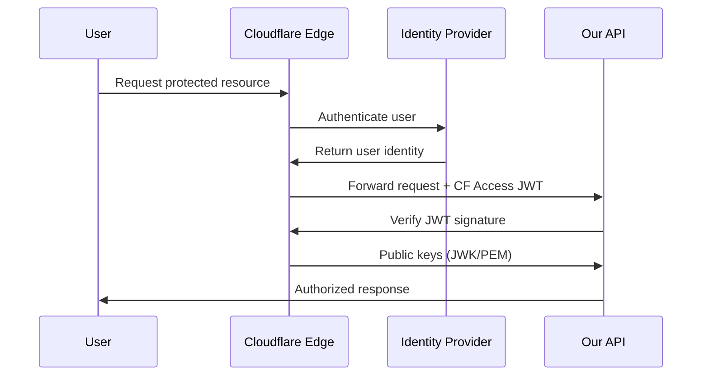
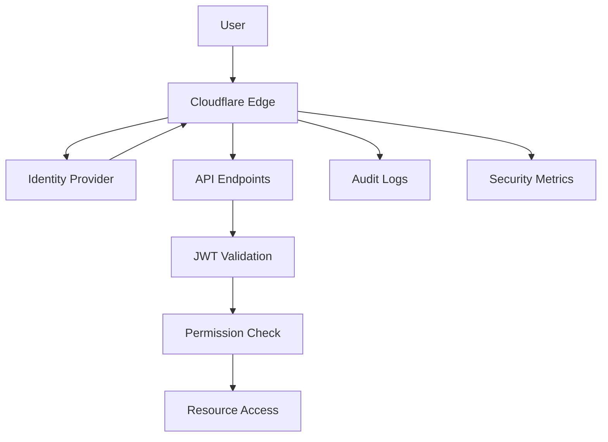

# Cloudflare Zero Trust Migration Plan

## Executive Summary

This document outlines a comprehensive migration strategy from our current custom JWT authentication system to Cloudflare Zero Trust Access. The plan preserves our stateless architecture while leveraging Cloudflare's enterprise-grade security infrastructure, providing improved security posture, simplified management, and seamless integration with our existing Nuxt 3 + Cloudflare Workers stack.

## Current State Analysis

### Existing Authentication Architecture

Our current system employs a sophisticated custom JWT implementation with the following characteristics:

**Strengths:**
- ✅ Stateless JWT-based authentication
- ✅ Hierarchical permission system (`category:resource` format)
- ✅ Bearer token + URL parameter dual authentication methods  
- ✅ Token revocation via JTI blacklisting in KV storage
- ✅ Request rate limiting with per-token usage tracking
- ✅ Comprehensive CLI tooling (`bin/jwt.ts`)
- ✅ Robust testing coverage

**Pain Points:**
- 🔧 Manual key rotation and management
- 🔧 Custom implementation maintenance overhead
- 🔧 Limited identity provider integration
- 🔧 No built-in audit logging or monitoring
- 🔧 Single point of failure for JWT secret management

### Protected Resources Inventory

**Public Endpoints (8/22):**
- `/api/health`, `/api/ping`, `/api/_worker-info`, `/api/stats`
- `/api/go/{slug}`, `/go/{slug}`

**Protected Endpoints (14/22):**
- `/api/auth` - Token validation (any valid token)
- `/api/metrics` - System metrics (`api:metrics`+)
- `/api/ai/alt` - AI alt-text generation (`ai:alt`+)
- `/api/tokens/{uuid}/*` - Token management (`api:tokens`+)  
- `/api/analytics*` - Analytics dashboard (`api:analytics`+)
- `/api/routeros/*` - RouterOS integration (`routeros:*`+)

## Cloudflare Zero Trust Architecture

### Key Components

**Cloudflare Access:**
- JWT-based stateless authentication (maintains our preferred architecture)
- Automatic key rotation every 6 weeks with 7-day overlap
- Rich identity provider ecosystem (OAuth, SAML, etc.)
- Policy-based access control with group support
- Built-in audit logging and security monitoring

**Token Verification Flow:**


**JWT Structure Comparison:**

*Current Custom JWT:*
```json
{
  "sub": "api:metrics",
  "iat": 1728464737,
  "exp": 1728551137,
  "jti": "unique-token-id",
  "maxRequests": 1000,
  "permissions": ["api", "analytics"]
}
```

*Cloudflare Access JWT:*
```json
{
  "aud": ["app-audience-tag"],
  "email": "user@company.com",
  "exp": 1728551137,
  "iat": 1728464737,
  "iss": "https://team.cloudflareaccess.com",
  "sub": "user-uuid",
  "type": "app",
  "identity_nonce": "security-nonce",
  "device_id": "device-uuid",
  "country": "US"
}
```

## Migration Strategy

### Phase 1: Parallel Implementation (Week 1-2)

**1.1 Zero Trust Organization Setup**
```bash
# Terraform configuration
resource "cloudflare_zero_trust_organization" "dave_io" {
  account_id  = var.cloudflare_account_id
  name        = "Dave.io Platform"
  auth_domain = "dave-io.cloudflareaccess.com"
}
```

**1.2 Identity Provider Integration**
- Configure primary IdP (Google Workspace recommended for personal projects)
- Set up service token authentication for API clients
- Configure backup authentication methods

**1.3 Application Registration**
Create Access applications for each protected resource group:

```bash
# Analytics Dashboard
resource "cloudflare_zero_trust_access_application" "analytics_app" {
  account_id      = var.cloudflare_account_id
  name           = "Analytics Dashboard"
  domain         = "analytics.dave.io"
  session_duration = "24h"
  type           = "self_hosted"
}

# API Access
resource "cloudflare_zero_trust_access_application" "api_app" {
  account_id      = var.cloudflare_account_id  
  name           = "Dave.io API"
  domain         = "api.dave.io"
  session_duration = "8h"
  type           = "self_hosted"
}
```

**1.4 Policy Configuration**
Map existing permission hierarchy to Access policies:

```bash
# Admin access policy
resource "cloudflare_zero_trust_access_policy" "admin_policy" {
  application_id = cloudflare_zero_trust_access_application.api_app.id
  account_id     = var.cloudflare_account_id
  name          = "Admin Full Access"  
  decision      = "allow"
  precedence    = 1
  
  include {
    email = ["dave@dave.io"]
  }
}

# Service token policy for CI/CD
resource "cloudflare_zero_trust_access_policy" "service_token_policy" {
  application_id = cloudflare_zero_trust_access_application.api_app.id
  account_id     = var.cloudflare_account_id
  name          = "Service Token Access"
  decision      = "non_identity"
  precedence    = 2
  
  include {
    service_token = [cloudflare_zero_trust_access_service_token.ci_token.id]
  }
}
```

### Phase 2: Authentication Layer Adaptation (Week 2-3)

**2.1 New Auth Utility Functions**
Create `server/utils/cloudflare-auth.ts`:

```typescript
import { createRemoteJWKSet, jwtVerify } from 'jose'

interface CloudflareAccessPayload {
  aud: string[]
  email: string
  exp: number
  iat: number
  iss: string
  sub: string
  type: string
  identity_nonce: string
  device_id?: string
  country?: string
  groups?: string[]
}

export class CloudflareAccessAuth {
  private jwks: ReturnType<typeof createRemoteJWKSet>
  private teamDomain: string
  private audTags: Map<string, string> = new Map()

  constructor(teamDomain: string) {
    this.teamDomain = teamDomain
    this.jwks = createRemoteJWKSet(
      new URL(`${teamDomain}/cdn-cgi/access/certs`)
    )
    
    // Map applications to AUD tags
    this.audTags.set('api', process.env.CF_ACCESS_API_AUD!)
    this.audTags.set('analytics', process.env.CF_ACCESS_ANALYTICS_AUD!)
  }

  async verifyToken(token: string, application: string): Promise<CloudflareAccessPayload> {
    const aud = this.audTags.get(application)
    if (!aud) throw new Error(`Unknown application: ${application}`)

    const { payload } = await jwtVerify(token, this.jwks, {
      issuer: this.teamDomain,
      audience: aud
    })

    return payload as CloudflareAccessPayload
  }

  // Map Cloudflare groups to our permission system
  mapGroupsToPermissions(groups: string[]): string[] {
    const permissionMap: Record<string, string[]> = {
      'admin': ['*'],
      'api-users': ['api'],
      'analytics-users': ['api:analytics', 'dashboard'],
      'routeros-users': ['routeros'],
      'ai-users': ['ai']
    }

    return groups.flatMap(group => permissionMap[group] || [])
  }
}
```

**2.2 Middleware Enhancement**
Update existing auth middleware to support both systems:

```typescript
// server/middleware/dual-auth.ts
export async function hybridAuth(event: H3Event, endpoint: string): Promise<AuthResult> {
  // Try Cloudflare Access first
  const cfAccessToken = getHeader(event, 'cf-access-jwt-assertion')
  if (cfAccessToken) {
    return await verifyCloudfareAccess(event, cfAccessToken, endpoint)
  }

  // Fall back to legacy JWT
  const legacyToken = extractToken(event)
  if (legacyToken) {
    return await verifyLegacyJWT(event, legacyToken, endpoint)
  }

  return { success: false, error: 'No authentication provided' }
}
```

### Phase 3: Gradual Migration (Week 3-4)

**3.1 Endpoint-by-Endpoint Migration**
Start with low-risk endpoints:

1. `/api/auth` - Token validation endpoint
2. `/api/metrics` - System metrics  
3. `/api/analytics/*` - Analytics dashboard
4. `/api/ai/*` - AI endpoints
5. `/api/tokens/*` - Token management (migrate last)

**3.2 Feature Flag Implementation**
```typescript
// Feature flag for auth system
const useCloudflareAuth = process.env.CF_USE_ZERO_TRUST === 'true'

export async function authorizeEndpoint(endpoint: string) {
  return async (event: H3Event): Promise<AuthResult> => {
    if (useCloudflareAuth) {
      return await cloudflareAuthHandler(event, endpoint)
    }
    return await legacyAuthHandler(event, endpoint)  
  }
}
```

**3.3 Testing & Validation**
- Parallel testing with both auth systems
- Load testing JWT verification performance
- Security audit of Access configuration
- Documentation updates

### Phase 4: Legacy System Deprecation (Week 4-5)

**4.1 Migration Completion Checklist**
- [ ] All endpoints migrated to Cloudflare Access
- [ ] Service tokens created for automation
- [ ] Access policies tested and validated
- [ ] CLI tools updated for new auth system
- [ ] Documentation completely updated
- [ ] Rollback plan tested

**4.2 Legacy System Removal**
- Remove custom JWT verification code
- Delete `bin/jwt.ts` CLI tool
- Clean up KV-based token storage
- Update API documentation

## Advanced Configuration

### Service Token Strategy
For API clients and automation:

```bash
# Create service tokens for different use cases
resource "cloudflare_zero_trust_access_service_token" "ci_cd_token" {
  account_id = var.cloudflare_account_id
  name       = "CI/CD Pipeline Token"
}

resource "cloudflare_zero_trust_access_service_token" "monitoring_token" {
  account_id = var.cloudflare_account_id
  name       = "Monitoring Service Token"
}
```

### Rate Limiting Integration
Replace custom rate limiting with Cloudflare's built-in capabilities:

```bash
# Gateway policy for rate limiting
resource "cloudflare_zero_trust_gateway_policy" "api_rate_limit" {
  account_id  = var.cloudflare_account_id
  name        = "API Rate Limiting"
  description = "Limit API requests per user"
  precedence  = 10
  enabled     = true
  action      = "block"
  filters     = ["http"]
  traffic     = "http.request.method == \"POST\" and http.host == \"api.dave.io\""
  identity    = "any(identity.email[*] not in {\"dave@dave.io\"})"
  # Additional rate limiting rules via Transform Rules
}
```

### Audit & Monitoring Integration
```typescript
// Enhanced logging with Access context
export function logSecurityEvent(event: H3Event, action: string, payload: CloudflareAccessPayload) {
  const securityLog = {
    timestamp: new Date().toISOString(),
    action,
    user: payload.email,
    device: payload.device_id,
    country: payload.country,
    endpoint: getPath(event),
    ip: getClientIP(event),
    userAgent: getHeader(event, 'user-agent')
  }
  
  // Send to Analytics Engine
  event.context.cloudflare?.env.ANALYTICS.writeDataPoint({
    blobs: [action, payload.email, payload.country],
    doubles: [Date.now()],
    indexes: ['security_audit']
  })
}
```

## Migration Timeline & Risks

### Timeline (5 weeks total)
- **Week 1-2:** Zero Trust setup and parallel implementation  
- **Week 2-3:** Authentication layer adaptation
- **Week 3-4:** Gradual endpoint migration
- **Week 4-5:** Legacy deprecation and cleanup

### Risk Mitigation

**High Risk: Service Disruption**
- *Mitigation:* Feature flags for instant rollback
- *Testing:* Comprehensive staging environment validation  
- *Monitoring:* Real-time auth success/failure metrics

**Medium Risk: Permission Model Complexity**
- *Mitigation:* Start with simple 1:1 mapping, evolve gradually
- *Documentation:* Clear permission mapping documentation
- *Testing:* Automated permission testing suite

**Low Risk: Performance Impact**  
- *Mitigation:* JWT verification is faster with Cloudflare's infrastructure
- *Monitoring:* Response time metrics during migration
- *Optimization:* Local JWT cache if needed

## Benefits Realization

### Security Improvements
- 🔐 **Enterprise-grade key management** - Automatic rotation, secure storage
- 🔐 **Identity provider integration** - OAuth, SAML, MFA support  
- 🔐 **Advanced threat detection** - Built-in anomaly detection
- 🔐 **Audit logging** - Comprehensive access logs
- 🔐 **Device posture** - Device compliance checking

### Operational Benefits  
- ⚡ **Reduced maintenance** - No more custom JWT infrastructure
- ⚡ **Better scalability** - Cloudflare's global edge network
- ⚡ **Unified management** - Single pane of glass for all access
- ⚡ **Compliance** - SOC 2, GDPR-ready audit trails

### Developer Experience
- 🚀 **Simplified onboarding** - SSO for new team members
- 🚀 **Better tooling** - Cloudflare dashboard + Terraform
- 🚀 **API compatibility** - Minimal code changes required
- 🚀 **Testing improvements** - Better local development auth

## Post-Migration Architecture

### Final Authentication Flow


### Simplified Auth Code
The final implementation dramatically reduces our auth complexity:

```typescript
// Simplified auth.ts after migration
import { CloudflareAccessAuth } from './cloudflare-auth'

const auth = new CloudflareAccessAuth('https://dave-io.cloudflareaccess.com')

export async function authorize(event: H3Event, app: string) {
  const token = getHeader(event, 'cf-access-jwt-assertion')
  if (!token) throw new Error('No access token')
  
  const payload = await auth.verifyToken(token, app)
  const permissions = auth.mapGroupsToPermissions(payload.groups || [])
  
  return { user: payload, permissions }
}
```

## Conclusion

This migration preserves our stateless JWT architecture while dramatically improving security posture and reducing maintenance overhead. The phased approach ensures zero downtime, and the feature flag strategy provides immediate rollback capability.

The end result is a more secure, scalable, and maintainable authentication system that leverages Cloudflare's enterprise infrastructure while maintaining our API's performance characteristics.

**Next Steps:**
1. Review and approve this migration plan
2. Set up Cloudflare Zero Trust organization  
3. Begin Phase 1 implementation
4. Schedule weekly progress reviews

*Remember: Better to be authentically secure than securely broken.* 🔐